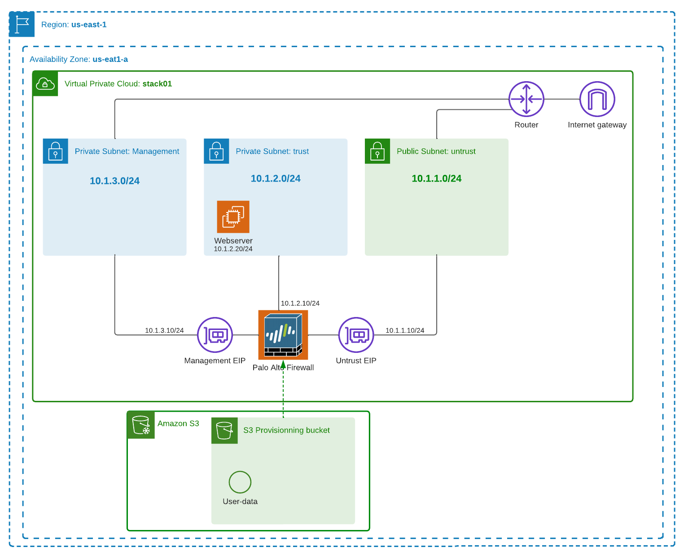

# 2-tiers Security stack

Basic 2-tiers stack to access a webserver



## Pre-requisites

- Access to [Palo Alto VM AMI](https://aws.amazon.com/marketplace/pp/prodview-ccntnbzdod74k?sr=0-1&ref_=beagle&applicationId=AWSMPContessa)
- Terraform version `1.1.7`

```bash
terraform --version
Terraform v1.1.7
on darwin_amd64
```

- Credentials to access AWS configured
- A security key available on AWS